# Docker Introduction

Docker is a platform that simplifies building, shipping, and running applications using containers. A container is a lightweight, portable, and self-contained environment that includes everything an application needs to run—code, runtime, system tools, libraries, and settings. Unlike virtual machines, containers share the host system’s OS kernel, making them more efficient and faster to start. Docker allows developers to package applications consistently, run them anywhere (local, cloud, or server), and manage multiple containers easily. Essentially, Docker makes deployment predictable, scalable, and isolated without the overhead of full virtual machines.

---
## ✅ Installation Check

``` bash
docker version
```
or
``` bash
docker --version
```
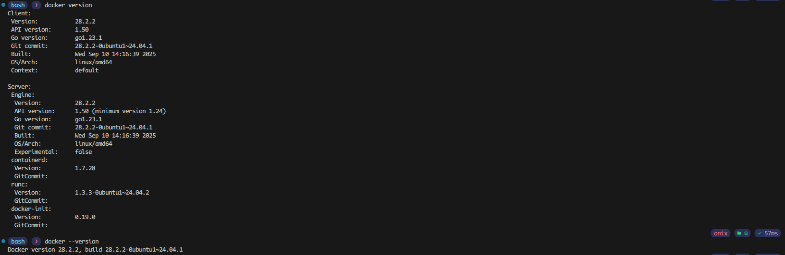

## ✅ Pull Docker Image

``` bash
docker pull <docker-image-name>
```
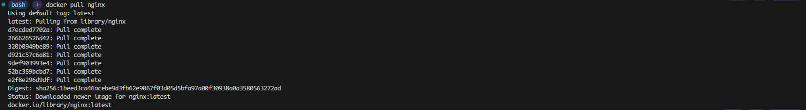

## ✅ Create / Run a Docker Container

``` bash
docker run -d --name <container-name> -p <host-port>:<container-port> <docker-image-name>
```
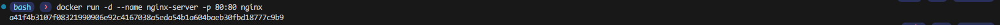

## ✅ List Running Containers

``` bash
docker ps
```
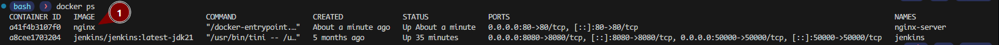

## ✅ List All Containers (including stopped)

``` bash
docker ps -a
```
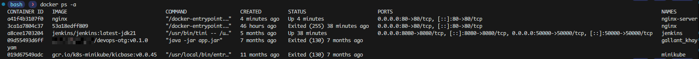

## ✅ View Logs

``` bash
docker logs <container-name>
```
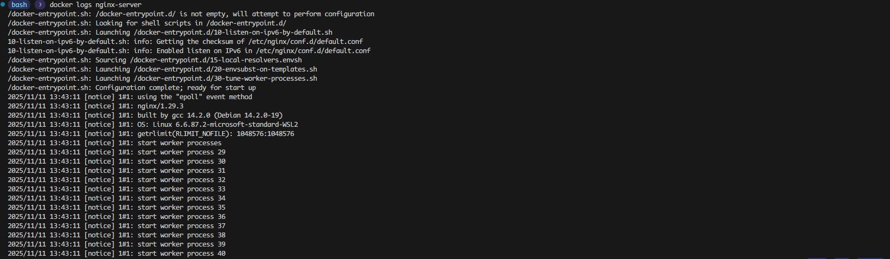

## ✅ Stop a Container

``` bash
docker stop <container-name>
```
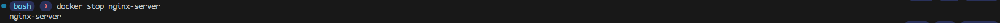

## ✅ Start/Restart a Container

``` bash
docker start <container-name>
docker restart <container-name>
```
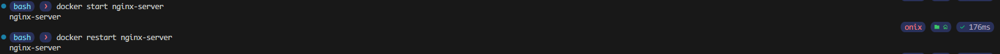

## ✅ Exec Into a Running Container

``` bash
docker exec -it <container-name> bash
```
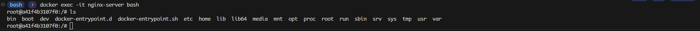

## ✅ Inspect Container (deep details)

``` bash
docker inspect <container-name>
```
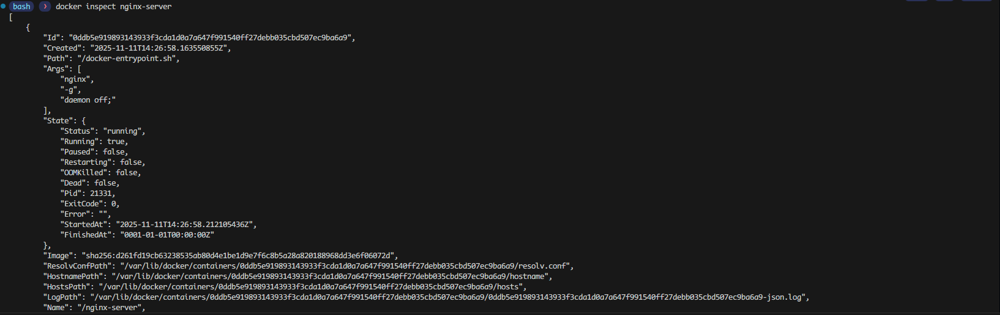

## ✅ Remove a Container

``` bash
docker rm nginx-server
```
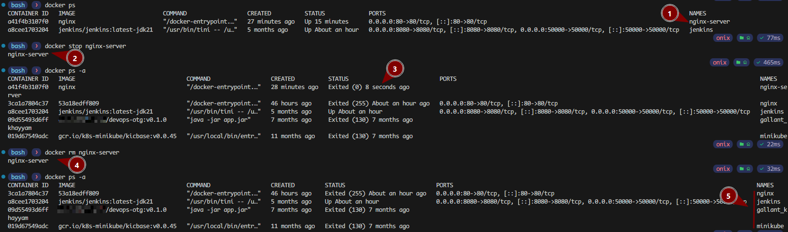

*To remove a container it must be stopped first or pass -f flag to force remove a running container.*

## ✅ Batch Stop/Delete Containers

Stop all running containers:

``` bash
docker stop $(docker ps -aq)
```
Remove all containers:

``` bash
docker rm $(docker ps -aq)
```
## ✅ List All Downloaded Docker Images

``` bash
docker images
```
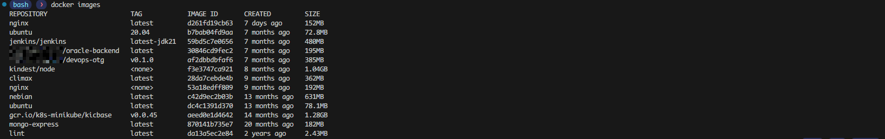

## ✅ Remove an Image

``` bash
docker rmi <docker-image-name>
```
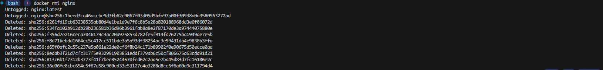

## ✅ Batch Remove All Images

``` bash
docker rmi $(docker images -q)
```

##  ✅ Container Restart Policy

Docker supports different restart policies to automatically restart containers under certain conditions.

```bash
docker run -d --restart=<policy> <docker-image-name>
```

### a. `no` (default)
Container does **not** restart automatically.

### b. `always`
Container restarts automatically whenever it stops.

### c. `on-failure`
Container restarts **only** if it exits with a non-zero status.

```bash
docker run -d --restart=on-failure:5 <docker-image-name>
```
*Restarts up to 5 times on failure.*

### d. `unless-stopped`
Container always restarts unless explicitly stopped by the user.

---

##  ✅ Disk Usage

### a. Check Docker disk usage

```bash
docker system df
```
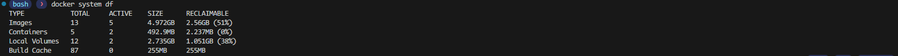

*Shows overall space used by images, containers, and volumes.*

### b. Detailed Docker disk usage

```bash
docker system df -v
```
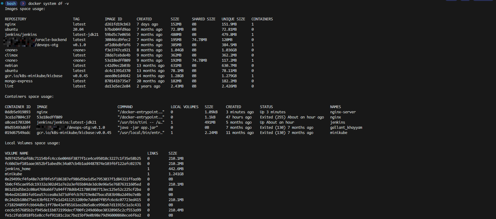

*Shows detailed image memory usage including layer sizes.*

---
