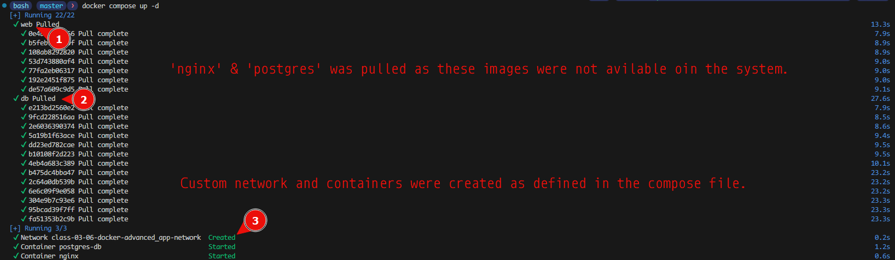
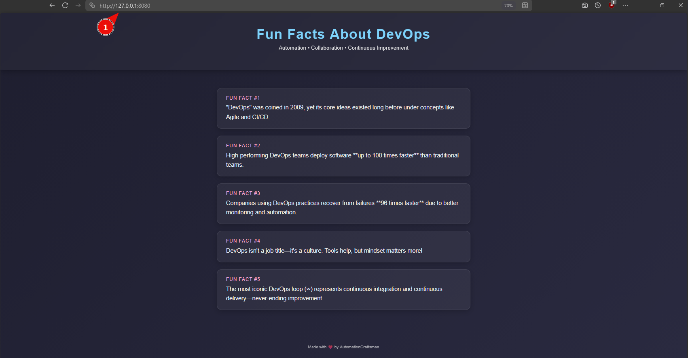
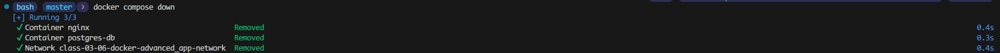

# Advanced Docker

This repository contains concepts, instructions, and examples of some Docker advanced topics like Dockerfile, Multi-stage build, Docker Networking, Volumes etc.

---
## ✅ Dockerfile: Blueprint for Images
A Dockerfile is a text file that contains all the commands needed to assemble a Docker image. It reads instructions from top to bottom, with each instruction creating a read-only layer.
#### Example Dockerfile Structure

``` bash
# Start from a base image (minimal, secure, and small base)
FROM node:18-alpine

# Set the working directory inside the container
WORKDIR /app

# Copy package files first to maximize build cache efficiency
COPY package*.json ./

# Install dependencies (creates a separate layer)
RUN npm install

# Copy the rest of the application source code
COPY . .

# Expose a port (metadata, useful for documentation)
EXPOSE 8080

# Define the command to run when the container starts (exec form preferred)
CMD ["npm", "start"]
```
#### Build Command:
``` bash
docker build -t <image-name>:<tag> .
```
## ✅ Dockerfile Instruction Keywordse
These instructions define the steps in building a Docker image layer by layer.
|Keyword|Functionality|Similarities/Differences|Example|
|---:|:---|:---:|:---:|
|FROM|Specifies the base image for the build. Must be the first non-comment instruction.|N/A|```FROM alpine:latest```|
|WORKDIR|Sets the working directory for subsequent instructions (RUN, CMD, COPY, etc.).|Similar to using cd in a shell.|```WORKDIR /usr/src/app```|
|COPY|Copies files or directories from the host's build context into the image filesystem.|COPY is generally preferred as it is more explicit; it only copies local files.|```COPY ./src /app/src```|
|ADD|Copies files, but can also extract compressed files (tar) and fetch remote URLs.|Use COPY unless you need tar extraction or remote URL support.|```ADD http://example.com/file.txt /app/```|
|RUN|Executes a command during the image build process.|Creates a new layer. Best practice is to chain commands with && to reduce layers.|```RUN apt update && apt install -y git```|
|CMD|Provides defaults for executing an executing container. Only the last CMD is used.|CMD is easily overridden when running a container (e.g., docker run <image> <new-command>).|```CMD ["node", "server.js"]```|
|ENTRYPOINT|Configures a container to run as an executable.|ENTRYPOINT is not easily overridden and sets the primary process.|```ENTRYPOINT ["/bin/bash"]```|
|ENV|Sets environment variables during the image build and in the running container.|N/A|```ENV DEBUG=true```|
|EXPOSE|Informs Docker that the container listens on the specified network ports at runtime.|Differs from ```-p```: EXPOSE doesn't publish the port; it's documentation.|```EXPOSE 80/tcp```|
|VOLUME|Creates a mount point and marks it as holding externally mounted data.|N/A|```VOLUME /data/logs```|

## ✅ Health Check (HEALTHCHECK)
The HEALTHCHECK instruction tells Docker how to test a running container to check if it is still working correctly. This is vital for load balancers and orchestrators.
#### Example Dockerfile Health Check
``` bash
# Check every 5 minutes, timeout after 3 seconds, retry 3 times
HEALTHCHECK --interval=5m --timeout=3s --retries=3 \
  CMD curl --fail http://localhost:8080/health || exit 1
```
#### Viewing Health Status
``` bash
docker inspect --format='{{json .State.Health}}' <container-id>
```
## ✅ Environment Variables (ENV)
The ENV instruction sets persistent environment variables.
#### Example Dockerfile ENV
``` bash
ENV APP_VERSION=1.0.0
# Multi-variable setting is more efficient:
ENV DB_HOST=database
ENV DB_PORT=5432
```
#### Running a Container with Overridden ENV
``` bash
docker run -e DB_HOST=production-db <image-name>:<tag>
```
## ✅ Docker Prune: Cleaning Up Resources
The docker system prune command is crucial for reclaiming disk space by removing unused Docker objects.
|Command|Description|
|:---:|:---:|
|```docker system prune```|Removes: stopped containers, all dangling images (untagged, no container referencing them), dangling build cache, and unused networks.|
|```docker system prune -a```|Removes everything above, PLUS: all unused images (not just dangling ones, but all images not associated with a container).|
|```docker volume prune```|Removes all unused volumes. (Volumes are not included in system prune by default to prevent data loss).|
|```docker builder prune```|Removes build cache exclusively.|

## ✅ Docker Save/Load and Export/Import
These commands are used for sharing images or container filesystems without relying on a registry.
|Command|Purpose|Target Resource|Description|Example Command|
|:---:|:---|:---:|:---:|:---:|
|Save|Creates a tar archive of an image (including all its history/layers).|Image|Preserves all image layers and metadata. Best for moving images between registries/hosts.|```docker save -o <custom-name>.tar <image-name>:<tag>```|
|Load|Loads an image from a tar archive created by docker save.|Image|Puts the image back into the local Docker image cache.|```docker load -i <custom-name>.tar```|
|Export|Creates a tar archive of a container's filesystem (no history/layers) - only the final state.|Container|Doesn't include image history or metadata. Used for simple filesystem backup/transfer.|```docker export <container-id> > <custom-container-name>.tar```|
|Import|Creates an image from an exported container filesystem archive.|Image|Creates a new, single-layer image from the archive.|```cat <custom-container-name>.tar \| docker import - <your-image-name>:tag```|

## ✅ Docker Multi-Stage Build
Multi-stage builds are an optimization technique that dramatically reduces the final image size by allowing you to copy only the necessary artifacts from a "builder" stage into a clean, minimal "final" stage.
#### Example ```Dockerfile``` Multi-Stage
``` bash
# --- Stage 1: Build Stage (The Builder) ---
FROM node:18-alpine AS builder

WORKDIR /app
COPY package.json .
RUN npm install
COPY . .
RUN npm run build 

# --- Stage 2: Final Stage (The Runtime) ---
FROM alpine:latest
# Copy static web server executable (e.g., Nginx or Caddy) if needed

# Copy only the compiled artifacts from the 'builder' stage
COPY --from=builder /app/dist /usr/share/nginx/html/

# Define runtime environment
CMD ["nginx", "-g", "daemon off;"]
```
## ✅ Docker Build Cache
Docker caches each instruction layer. If an instruction and the context it depends on (e.g., files copied) hasn't changed, Docker reuses the existing layer, resulting in a fast build.

* Best Practice: Place the least-frequently changing instructions (like copying dependency files and running dependency installation) near the top of the Dockerfile.

Invalidating Cache:
The cache is invalidated when a file changes. If you change a file copied in an early COPY instruction, all subsequent RUN instructions will re-run.

#### Example of Cache-Friendly Layering
``` bash
COPY package.json package-lock.json ./    # Layer 1: dependencies (stable)
RUN npm install                           # Layer 2: install (stable)
COPY . .                                  # Layer 3: application code (volatile)
```

## ✅ Docker Volumes
Volumes are the primary mechanism for persisting data in Docker. They are fully managed by Docker and stored in a designated area of the host machine.

#### Volume Management Commands
|Command|Functionality|Example|
|:---:|:---:|:---:|
|Creation|Creates a new named volume.|```docker volume create <volume-name>```|
|Listing|Shows all volumes.|```docker volume ls```|
|Inspection|Provides detailed information about a volume (driver, mount point).|```docker volume inspect <volume-name>```|
|Deletion|Deletes a specific volume.|```docker volume rm <volume-name>```|

#### Volume Management Commands
|Method|Description|Pros|Cons|Example Command|
|:---:|:---:|:---:|:---:|:---:|
|Volume Mount|Data is stored in a dedicated part of the host filesystem managed by Docker.|Optimal I/O performance, managed life-cycle, highly portable and works across Linux, Windows, and macOS.|Files are harder to access/edit directly by host tools.|```docker run -v <volume-name>:/app/data <image>```|
|Bind Mount|Data is mapped to an arbitrary location on the host machine (e.g., a source code folder).|Easy host access for editing code/config, essential for local development.|Less secure, susceptible to host path changes, potential performance issues.|```docker run -v /your/desired/path:/app/src <image>```|

## ✅ Docker Networks
Docker networks enable containers to communicate securely with each other and the outside world.

#### Network Types and Functions
|Type|Function|Pros|Cons|
|:---:|:---:|:---:|:---:|
|Bridge (Default)|Creates a private network for containers on a single host to communicate with each other using container names as DNS resolution.|Isolation and simple DNS discovery; default and easy to use.|Needs port mapping (-p) for external access; limited to one host.|
|Host|Removes network isolation, sharing the host's network stack directly.|Best performance (no NAT/routing overhead); quick access to host services.|Security risk (no isolation); port conflicts with host ports.|
|None|Disables all networking for the container.|Ideal for secure, isolated batch jobs that require no external access.|Container cannot communicate with host or other containers.|

## ✅ Assigning Container to a Network
Containers should be assigned to a custom bridge network for easier service discovery and better isolation.

#### Create a custom network
``` bash
docker network create --driver <driver-name> <network-name>
```
```--driver <driver_name>```: This flag specifies the network driver you want to use. Common drivers include:

* ```bridge```: The default network driver, suitable for single-host deployments. Without ```--driver <driver-name>``` it will create the ```bridge``` network by default.
* ```overlay```: Used for multi-host networking in Docker Swarm.
* ```host```: Connects containers directly to the host's network stack.
* ```macvlan```: Assigns a unique MAC address to each container, allowing them to appear as physical devices on the network.
* ```ipvlan```: Similar to macvlan, but shares the parent interface's MAC address.
#### Run the container and assign it
``` bash
docker run -d --name <your-container-name> --network <your-network-name> -p 80:80 <image-name>:<tag>
```
#### Connecting a Running Container
``` bash
docker network connect <network-name> <container-name>
```
## ✅ Docker Compose: Local Orchestration
Docker Compose is a tool for defining and running multi-container Docker applications. It uses a YAML file (```docker-compose.yml```) to manage the entire application stack (services, networks, and volumes).

#### ```docker-compose.yml``` Example
``` bash
version: '3.8'                                            # Not mandatory with 'docker-compose-v2'

services:
  db:
    image: postgres:15.15
    container_name: postgres-db
    restart: unless-stopped
    environment:
      POSTGRES_USER: myuser
      POSTGRES_PASSWORD: secret123
      POSTGRES_DB: myapp
    volumes:
      - postgres_data:/var/lib/postgresql/data
    networks:
      - app-network

  web:
    image: nginx:1.29
    container_name: nginx
    restart: unless-stopped
    ports:
      - "8080:80"
    volumes:
      - ./html:/usr/share/nginx/html:ro                   # put your index.html here
    depends_on:
      - db
    networks:
      - app-network

# Named volumes
volumes:
  postgres_data:

# Custom network
networks:
  app-network:
    driver: bridge
```
#### Docker Compose Commands
|Command|Functionality|Example (with ```docker-compose-v2```)|
|:---:|:---:|:---:|
|Up|Builds/pulls images and creates/starts containers, networks, and volumes.|```docker compose up -d```|
|Stop|Stops running containers without removing resources.|```docker compose stop```|
|Down|Stops and removes containers, networks, and default volumes (use -v to remove named volumes).|```docker compose down -v```|
|Logs|Views consolidated output from all services.|```docker compose logs -f```|
|Execute|Runs a command in a service's running container.|```docker compose exec web bash```|




